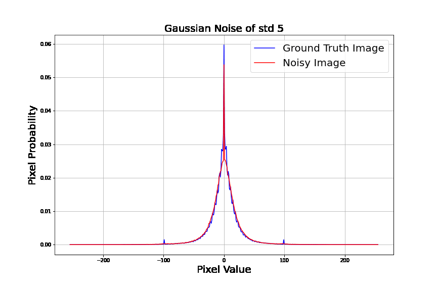
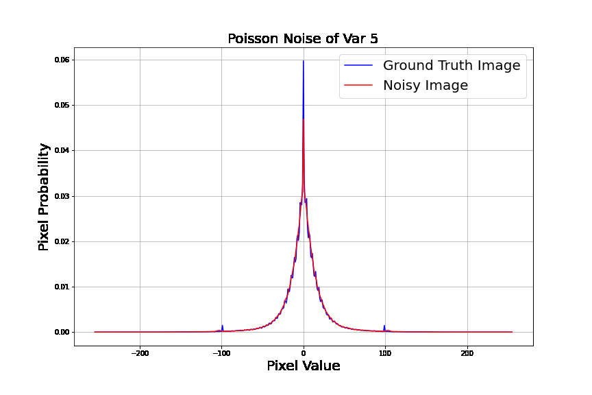
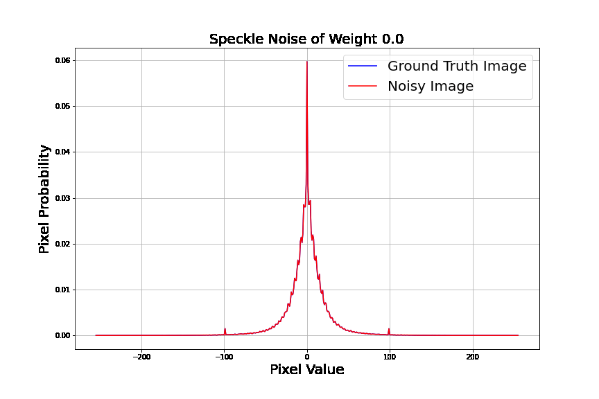
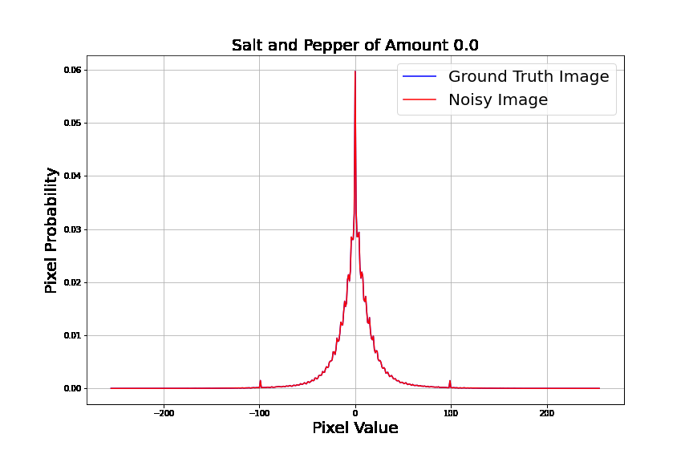

# Introduction
In this work, we proposed a noval image loss measurement specifically sensitive towards noise and corruption using image gradients. This repo is an official release of our code from our paper at (https://www.mdpi.com/1424-8220/22/2/639)


We show that different image corruption have different image gradient statistics responses when analysed using our tool. This work can be useful when performing noisy study or trying to model a new noise such as X--ray Noise.


# Contributions
1. Noise Model Parameters Estimation: We show that our proposed loss can be used as a method of noise parameters estimation for different types of known noise model. This is particularly useful in data augmentation, where the user would need to create sensible and coherent noise that are similar to the dataset.
2. Noise Analysis Tools: The proposed algorithm show to have different response agaisnt different type of image corruptions.
3. Loss in Image Processing Algorithm: The proposed loss can be used for image optimization tasks, such as image denoising. In our tutorial, we show that a greater Image Quality Assessment (IQA) score is not equivalent to a good image restoration. This is because the information to noise ratio have been significantly reduced. We show that using the proposed loss, we are able to preserve the image information and have a better information to noise trade off compared to the well--known SSIM.


# Loss Visualisation of Different Noise Model
Here we show several examples of the image gradient statistics of different noise model
## Gaussian Noise

## Poisson Noise

## Speckle Noise

## Salt--and--Pepper Noise



# Future Works:
1. The proposed loss can be modified as an image quality assessment score.
2. The proposed algorithm is a full reference solution, the next step is to approximate the ground--truth image gradient statistics and propose a no reference solution


# Reference


If you use this work, use this to cite it


```tex
@article{chin2022study,
  title={A Study on Distortion Estimation Based on Image Gradients},
  author={Chin, Sin Chee and Chow, Chee-Onn and Kanesan, Jeevan and Chuah, Joon Huang},
  journal={Sensors},
  volume={22},
  number={2},
  pages={639},
  year={2022},
  publisher={MDPI}
}
```


